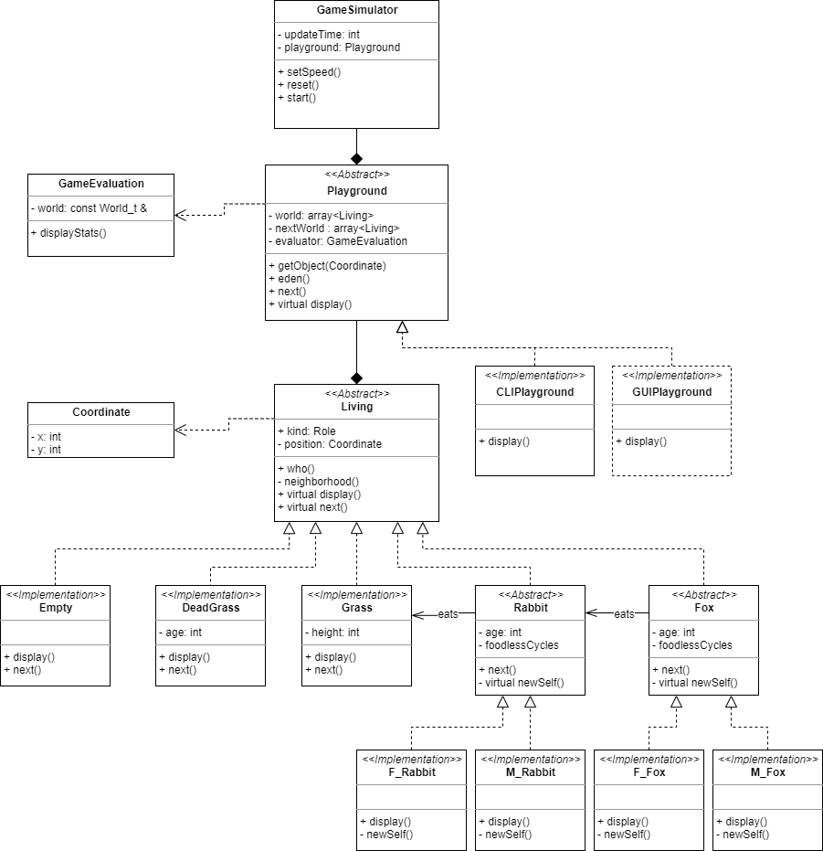

Das Mini-Projekt ”World of the Fittest” wurde im Rahmen des Moduls C++ Objektorientiertes Programmieren durchgeführt. Es wurde ein Programm erstellt, welches zum Simulieren der Interaktion zwischen Raubtier und Beute dient. Der Code wurde in C++ implementiert. Das Resultat ist eine gut Strukturierte und Funktionierende Software, welche beliebig erweitert werden kann.

UML class diagram:

